# AWS Control Tower with Juniper Networks vSRX Firewall as Central Security VPC

### Summary


<ul>

The AWS Control Tower with vSRX as Central Security VPC solution, provides an automated account, organization, security and governance workflow with centralized Juniper Networks firewalls. This solution provides administration teams the ease of adding accounts in a AWS multi-account environment, while automatically creating organizational security, security policies with Next Generation firewall feature capabilities within AWS's infrastructure.

The Next-Generation Firewall (NGFW) has evolved to become the ideal solution for visibility, control, and prevention at the network edge and data center. Threat protection begins with complete visibility into who and what is traversing the network. Combined with behavior and the ability to detect threats in real time, Juniper delivers the most effective NGFW in the industry, reliably safeguarding users, applications, and devices, delivered on-premises, in the cloud, or as a service.

AWS Control Tower provides an easy way to set up and govern a secure, multi-account AWS environment with Control Tower's landing zones. It provides AWS Organizations, ongoing account management and governance as well as implementation of AWS's best practices. Architects, Builders and Administrators can provision new AWS accounts with a few steps while conforming to our company policies and best practices.

Combining Juniper's SRX firewalls with AWS Control Tower, extends security and visibility across multiple AWS accounts by creating a centralized security infrastructure hub VPC. All traffic from newly created AWS accounts are now automatically routed through Juniper's security infrastructure VPC. In addition to enforcing organizational traffic through the central Juniper security VPC. All default VPC networks, IP networks, internet gateways, security groups are removed to prevent shadow IT and configurationism access. This combined solution of Juniper's SRX firewall, AWS Control Tower, AWS Organizations, AWS Service Control Policies and Guardrails, organizational security polices are enforced reducing overall organization risk.

By combining Juniper Networks Security Director management solution, organization can extend their security policy management from AWS cloud, to a multi-cloud, hybrid cloud, private cloud, collocation and traditional on-premise infrastructure. With Security Director, organizations can now have a single centralized security management source across their entire organization no mater the location.


</ul>


<p align="center">
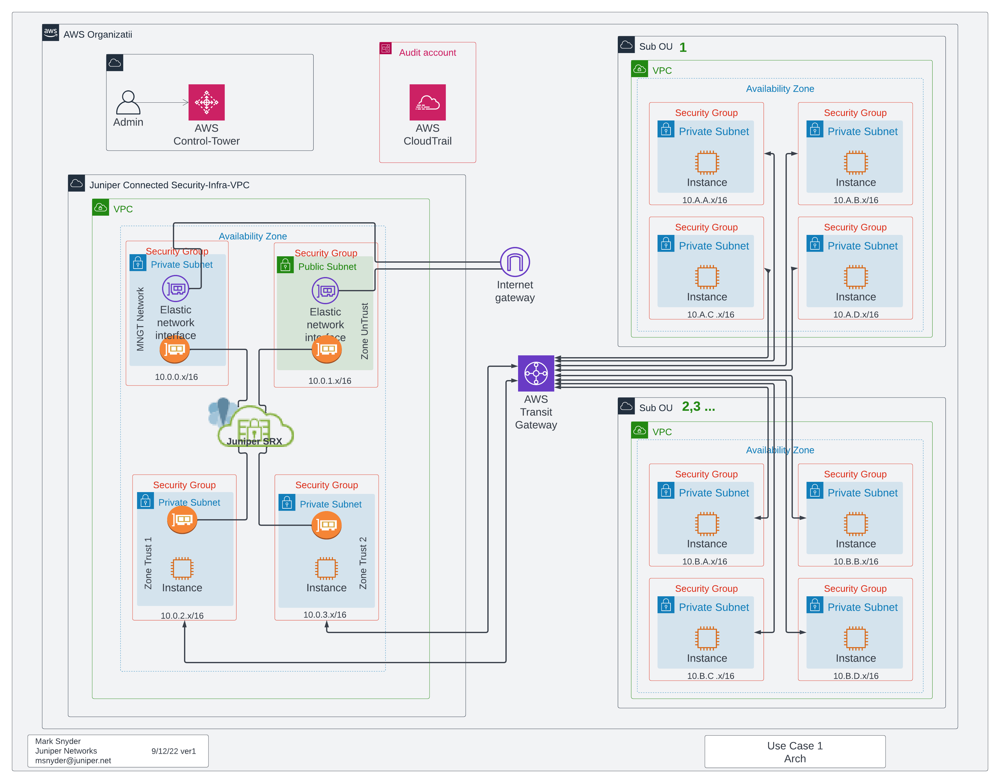</center>
</p>

 <h3> Expected architectural design principles  </h3>

<ul>

 <h4> Security Infrastructure VPC </h4>

  To provide a security VPC infrastructure were all other AWS account's Organizational units traverse through a specified security hub VPC. The security infrastructure hub VPC acts as a head-end egress and ingress point for all traffic coming into AWS.  Traffic is forced through the SRX firewall Allowing for firewall advanced features to be used to inspect, secure and enforce traffic.  This includes, traffic filtering rules, IPS, URL-filtering, traffic inspection, in addition to advance features such as Juniper's encrypted traffic analysis, threat intelligence and protection services.


  <h4> Security Infrastructure VPC - Network segments </h4>

 Four Network Segments are created. The public Internet segment is used for all public egress and ingress traffic. The management segment for Juniper SRX management, and two private segments, east and west.  The public subnet is directly publicly facing and should be considered an insecure segment. The default configuration, is to allow all established session out. This may need to be adjusted on organizational design requirements. The management subnets, AWS security groups default is to allow any ssh public access. Which should be edited at time of initial deployment from the instructions underneath.  East and west subnets are for Transit Gateway connectivity, and for future expansion considerations. Expansions can include, zone segmentation (levels of security) or for third party and appliance integrations, TBD.


 <h4> Scaling, and High Availability </h4>

 <h4> Auto-Scaling </h4>

 The SRX can be scaled horizontally for larger workload and traffic flows. Scaling is achieved by utilizing AWS Auto-Scaling groups. For integration of Auto-scaling, this requires manual setup and configuration outside of the deployment steps here. Refer to the link section underneath for information on how to configure auto scaling groups.

<h4> High Availability </h4>

High Availability can be achieved by using AWS application load balancers. For integration of Auto-scaling, this requires manual setup and configuration outside of the deployment steps here.  Refer to the link section underneath for information on how to configure high availability. 

  <h4> Organization units </h4>

  <h4> Organizational structure - Parent and Child </h4>

  All Organizational units that are to be included as part of the security VPC, are to be created as a child organization under the parent (security infrastructure hub VPC). Metatags are in place that will allow future, multi security infrastructure hubs to allow for separations of security domains and traffic. Additionally to allow, deployment checks of what security domain that child OU should follow.

 <h4> Account creations </h4>

  During new account creation, all accounts will have default VPC networking, Internet gateways, subnets and security groups deleted and removed, replaced with new architect elements helping to ensure traffic is sent through the security infrastructure VPC.

 <h4> Traffic flow - routing </h4>

All child organizational unit's routing and traffic flows are handled through Transit Gateway associations and subneting and subnet associations at the time of automated creation. The Parent Security VPC is included with the exception of default gateway segment that is explicitly created.

 <h4> Network Addressing - IP CIDR </h4>

<h5> Security Infrastructure hub VPC </h5>

 All traffic is passed through this Parent VPC. Since traffic only traverses the security VPC, all addresses for the parent VPC are static addresses and are assigned during deployment. Future revisions may allow customization.


 <h5> Child Organizational units </h5>

 All child organizational units have a VPC CIDR block created and assigned at time of account creation. The account is assigned a major CIDR range with a 16 bit mask. The first 8 bit mask is static, with the remaining bits incremented for each child account and Organizational unit creation. For example account A 10.a.x.x and account B 10.b.xx. Each VPC is further segmented into four 24 bit equally divided masked subnets. For example, account B would have 10.b.a'.x/24, 10.b.b'.x/24, 10.b.c'.x/24 and 10.a.d'.x/24.  Four subnets are created in the VPC. 


<h5> IPv4 </h5>

Only IPv4 is used in this solution.

<h4> Methodology and workflow </h4>

The workflow intent is for the initial configuration for the Parent Security Infrastructure VPC to deployed once, and the child Organizational units several times. The child organizational units and account processes infrastructure, networking and connectivity are all automated and repeated as part of the solution .

<p align="center">
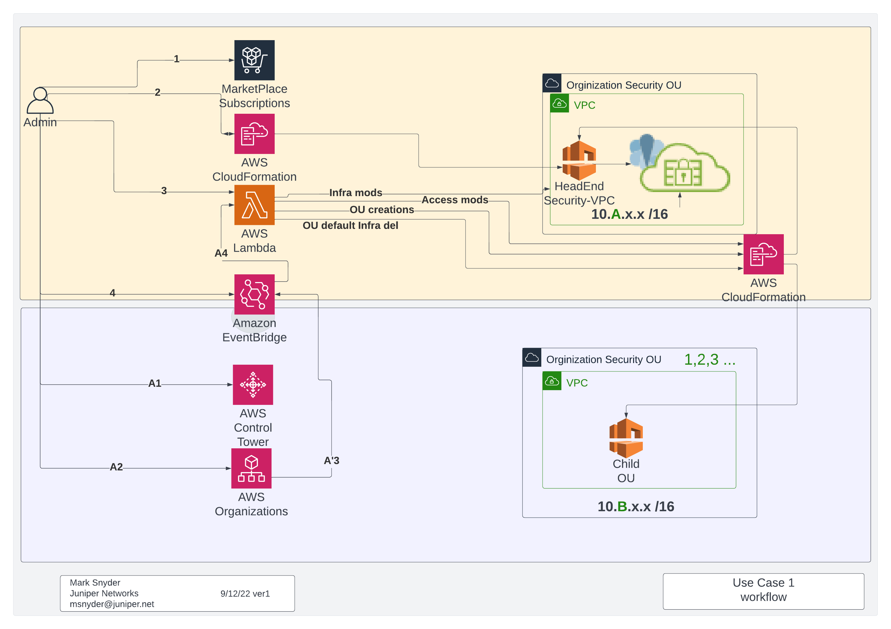</center>
</p>

</ul>


<h3> Deployment, Setup and Installation </h3>

<ul>

<h4> Components Used </h4>

 Juniper Networks vSRX from the AWS Market Place, AWS Control Tower, AWS Organizations. CloudFormation, Lambda, EventBridge, Systems Parameter Store, Simple Storage Services and Resource Access Manager are used for this solution.  AWS Control Tower Account-factory or AWS Organizations can be used for creating Accounts and Organizations.

<h4> Market Place Subscriptions </h4>

An AWS Market Place subscription for the Juniper vSRX is required for this solution. Both BYOL or PAYG will be  needed. It is recommended to use the latest vSRX version.

<h4> Prerequisite setup and settings </h4>

AWS Control Tower must have been previously deployed. AWS IAM roles, Control Tower and CloudFormation, Execution and administration must be deployed for all Organizations managed by Control Tower.  [https://docs.aws.amazon.com/control tower/latest/user guide/deployment.html]()

<h4> Simple Storage Service (S3)- </h4>

An S3 bucket must be created for the storing of Cloud Formation Templates. AWS Lambda will refer to these scripts for deployment.

<h4> Identity and Access Management (IAM) </h4>

 An administration account will be needed that is NOT the root account. This account should have execution privileges needed to deploy Control Tower, CloudFormation templates, Lambda, S3, and IAM roles.

 An IAM role for lambda will need to be created. The lambda role will need to have access to the S3 bucket were CloudFormation templates are stored and the ability to deploy CloudFormation templates.

 This solution, additionally creates an IAM role in each child Organizational Unit account. This role is created for the deletion of the default VPC, Internet Gateway and all the dependencies. This role can be deleted after the child OU is created. However, this role can be used for later administration.


<h4> Lambda - functions </h4>

 Two lambda functions will need to be created. One Lambda function will be needed for Organization registration, and a second for account move and registration.

 The Organization Lambda function, lambda_main.py, is responsible for the core infrastructure and all address management for child organizational units. This lambda function must be called by the Organization registration EventBridge. It should be noted that Organizational units can either be created with Control Tower or within AWS Organizations and then registered in Control Tower.

 The second Lambda script, ddvpc_function.py, is responsible for the deletion on the default VPC and Internet Gateway. This function is called from one of two EventBridge rules. Either when a new account is created in Account Factory, or if the account was created in AWS Organizations and then when the account is moved.

<h5> Extreme caution </h5>

Extreme caution needs to be practiced for ddvpc_function.py and when it is called. Currently, there are NO checks for "if" the account being moved, is in an account that is within a child organizational unit under the Security Infrastructure VPC.  This check is planed for future releases. There are currently no tags in organizations to check and needs coding to determine, parent Organization, child Organizational Unit, and "managed" account relationships...

Lambda functions must ensure all timeouts are at least 15 minutes or scripts "may" fail to complete.

<h4> EventBridge </h4>

Three EventBridge rules need to be created. Each rule triggers lambda functions specific to Organizational Unit registration in Control Tower, AWS Account creation within Account Factory, or an account that was created within Organizations, and moved into a child Organizational Unit.  It should be noted, that technically this account is not enrolled by Control Tower.

<h4> EventBridge Control Tower registration trigger </h4>

```
{
  "source": ["aws.controltower"],
  "detail-type": ["AWS Service Event via CloudTrail"],
  "detail": {
    "eventName": ["RegisterOrganizationalUnit"]
  }
}
```

<h4> EventBridge AWS Organization account move trigger </h4>

```
{
  "source": ["aws.organizations"],
  "detail-type": ["AWS API Call via CloudTrail"],
  "detail": {
    "eventSource": ["organizations.amazonaws.com"],
    "eventName": ["MoveAccount"]
  }
}
```

<h4> EventBridge Account Factory / Control Tower account creation trigger </h4>

```
{
  "source": ["aws.controltower"],
  "detail-type": ["AWS Service Event via CloudTrail"],
  "detail": {
    "eventName": ["CreateManagedAccount"]
  }
}
```

<h4> SSH Key-pair </h4>

 Create an SSH key-pair to be used for remote administration of the vSRX after deployment. Creating user key-pairs, or using AWS hardware key management is supported by the vSRX, and can be used my modifying vSRX resource section of hsst1.json CloudFormation template.  Refer to the link section underneath for information on how to configure HSM.

<h4> Organization Unit for the Security Infrastructure </h4>

An Organization unit will need to be created as the Security Infrastructure that is a child of the root account of "your" organization/company/identity. The identity of the Organization Unit should have an ID that begins with "OU-" and NOT "r-" or "o".  This new organization will have all traffic from child Organizational Units "ou-" flow through this new OU. Make note of the OU ID created. For example ou-ad12-a1b2b3b4.

<h4> Owner account for Security Infrastructure OU </h4>

The owner account with be a new AWS account used specifically as the owner for all related account functions for the OU. Make note of the 12 digit ID of the account created.  This will be used as part of the deployment.

<h4> Service Control policies (SCP) and Guardrails </h4>

For creating, editing and applying policies.   <b>

[AWS Organizations Service Control
 Policies](https://docs.aws.amazon.com/organizations/latest/userguide/orgs_manage_policies_scps.html)

  <b>

[AWS Control Tower Guardrails](https://docs.aws.amazon.com/controltower/latest/userguide/guardrails.html)


<h4> General Deployment </h4>

Please ensure all prerequisites have been completed. Once completed the initial Security Infrastructure hub VPC can be deployed. The security VPC is created by deploying two CloudFormation templates. HSST1 and HSST2. Head-end Stackset Security Template 1 and 2.

<h4> Head-end Security Infrastructure HSST1 </h4>

 1. Ensure that the account that is being used for the next steps are being performed from a top organization account and is "NOT" the root account. Additionally this step "IS" performed at the root organization AND NOT at Security Infrastructure OU created from the prerequisites.

2. Using AWS CloudFormation, ensure that Stacksets is selected and select "create StackSet" create a new Create Stactset. Leave the default settings and use the hsst1.json template. Filling the fields similar to the fields here, changing the IP address for remote SSH management, the 12 digit account and the name of the key-pair created in the prerequisites.

<br>

<p align="center">
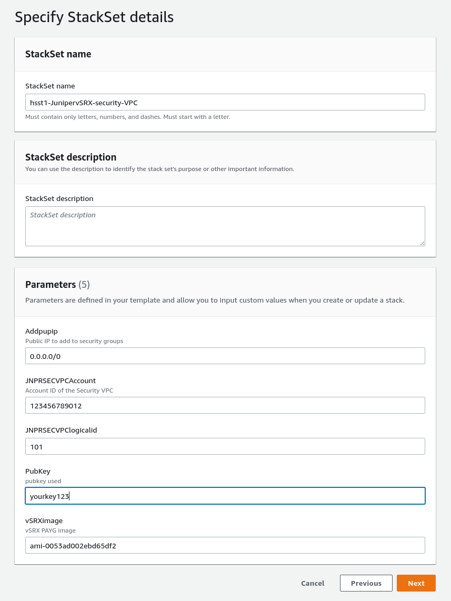</center>
</p>

 3. Select next until the following screen. Make sure to change "Deploy to organization units(OUs)" with the OU ID created earlier. Additionally, specify the region to US East (N.Virginia)


 <br>


 <p align="center">
 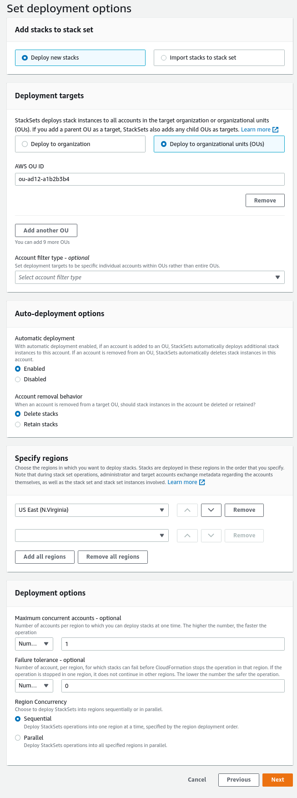</center>
 </p>

 4. Click Submit

 5. Wait at least 3 minutes until the stackset Operations shows a Status as SUCCEEDED as shown here.

 <br>


 <p align="center">
 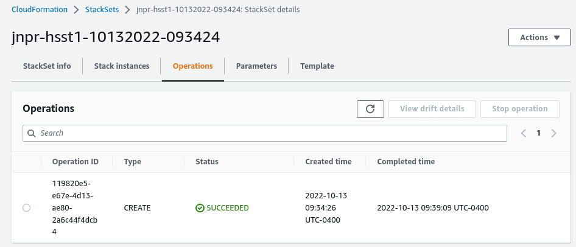</center>
 </p>

<h4> Head-end Security Infrastructure HSST2 </h4>

1. For hsst2, leave the default parameters section as is.  These are parameters that are being pulled from AWS System Manager Parameters store and were generated from the previous step. Select next until the deployment targets page.  As in the previous step, ensure to change "Deploy to organization units(OUs)" with the OU ID created earlier. Additionally, specify the region to US East (N.Virginia). click next until submit and enter submit.

 2. Check the status of the StackSet to ensure it was successful.

<h4> vSRX instance </h4>

Prior to traffic getting routed through the vSRX. The vSRX will need to be rebooted. Please stop and restart the vSRX prior to the next steps.

<h4> General Use - Using the solution and Day-to-Day use </h4>

With the setup portion and deployment complete new child Organizational Units can be created. When created the child Organization Unit will have all it's traffic routed back through the Security Infrastructure hub VPC. All AWS Security Control Policies that were created and Guardrails will be applied to the child organizational units.

Ensure that the account that is being used for the next steps are being performed from a top organization account and is "NOT" the root account. Additionally this step "IS" performed at the root organization AND NOT at Security Infrastructure OU created from the prerequisites.

<h4> Creating new child Organizational Units </h4>

There are two methods for creating Organizational Units, from either Control Tower or from AWS Organizations dashboards. In the example underneath, the Security Infrastructure VPC, is the organization "FORG" and any child organizational unit, are children who's traffic will flow through the Security infrastructure hub VPC. The child OUs are sub1,sub2 and sub3 as examples.

<h4> Method 1 - Using Control Tower to create the child OU </h4>

For creating child Organizational units using Control Tower

1. Create a new organization, from the Create resources "Create organization unit".

<br>


<p align="center">
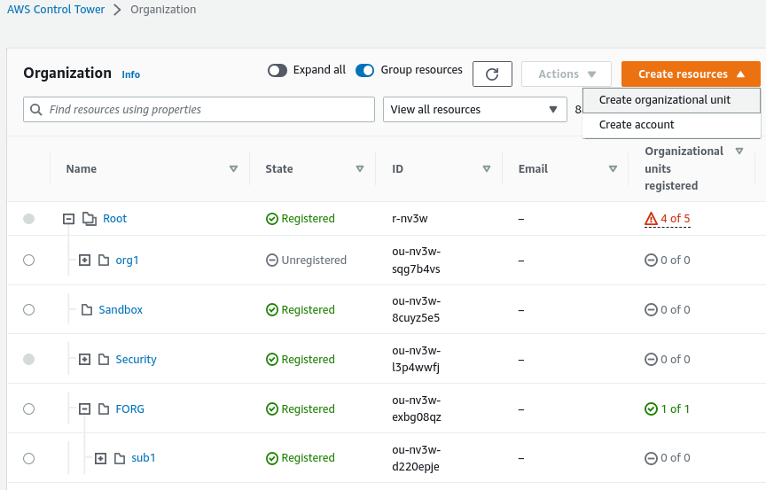</center>
</p>


2. In the add an OU screen add the name of the new child OU and ensure that the Parent OU is the Security infrastructure OU. In the example shown, it is FORG. 

<br>


<p align="center">
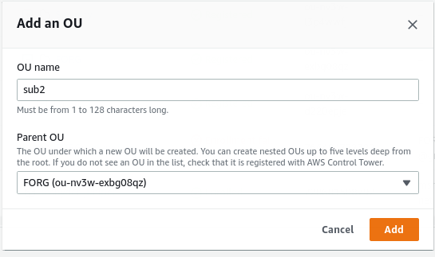</center>
</p>

3.
In the screen capture underneath, the organizational unit is being created.

<br>


<p align="center">
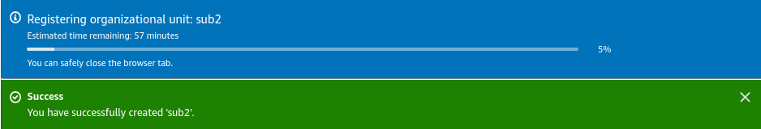</center>
</p>


4. Once completed, note the completed registered sub2 child OU.

<br>


<p align="center">
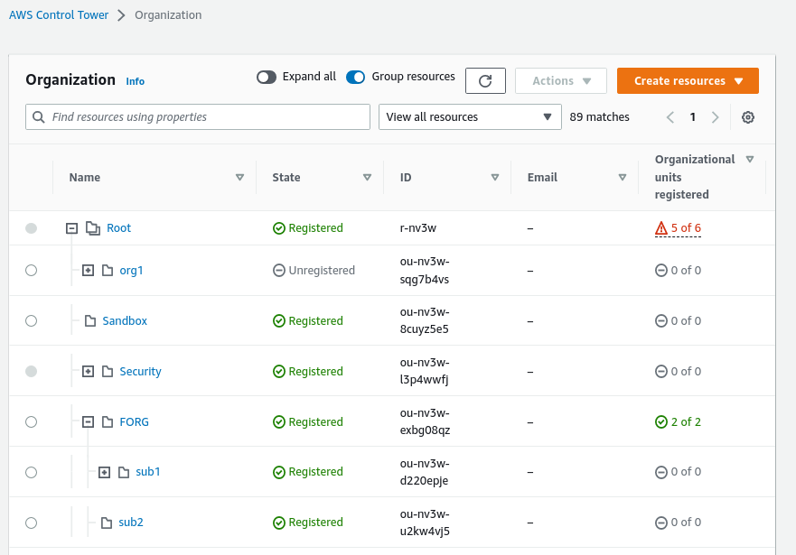</center>
</p>


<h4> Method 2 - Using AWS Organizations to create the child OU </h4>

For creating child Organizational units using AWS Organizations

1 .Check the box next to the Parent OU of the Security Infrastructure OU. and from the Action menu > under Organization unit, select Create new.

<br>


<p align="center">
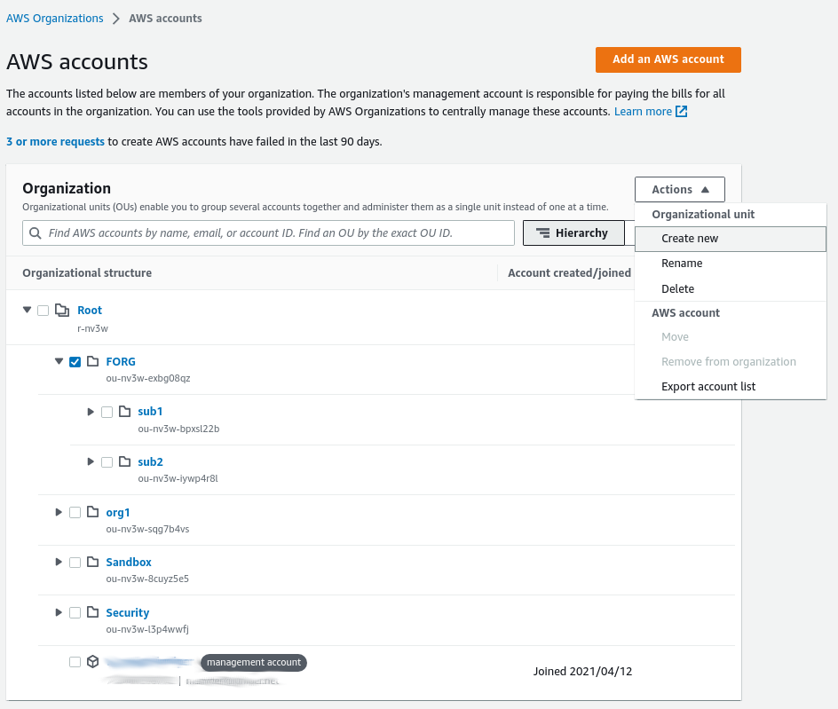</center>
</p>


2. Enter the new child Organizational unit, and select Create organizational unit.

<br>


<p align="center">
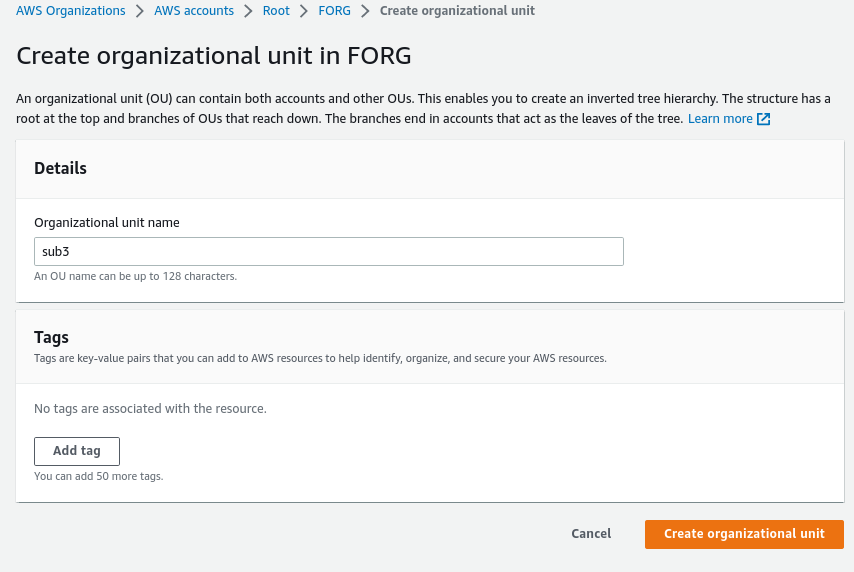</center>
</p>


3. Now that the OU is created it needs to be registered in Control Tower.
From the Control Tower screen, select the OU , just created. from the action menu, select register OU and accept the terms and conditions.

<br>


<p align="center">
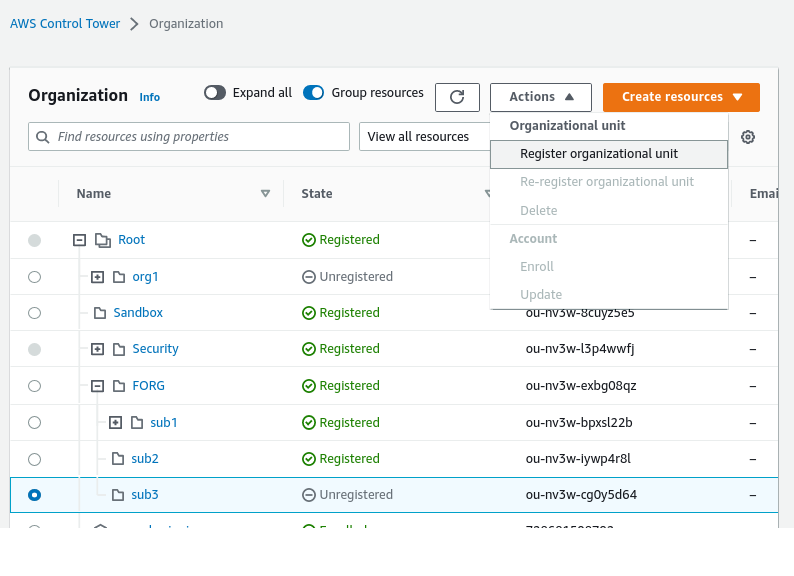</center>
</p>


From both methods above, the child organizational unit is registered with Control Tower.

<p align="center">
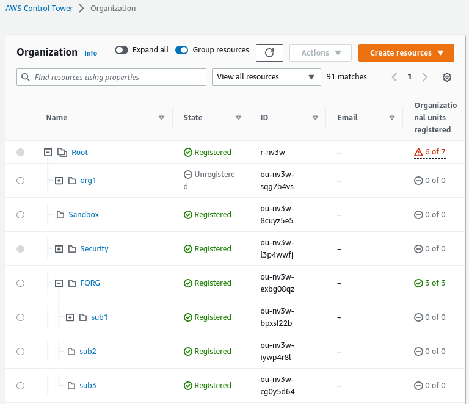</center>
</p>

<h4>Creating new accounts for the new child Organizational Units </h4>

Accounts can be created with two methods, either from Control Tower's Account factory, or through AWS Organizations.

<h4> Method 1 - Using Control Tower's Account factory to create an account </h4>

1. From the Control Tower dashboard, either select Organizations from the left, Create new resource, Create account. Or, Account Factory from the left and Create account

<br>


<p align="center">
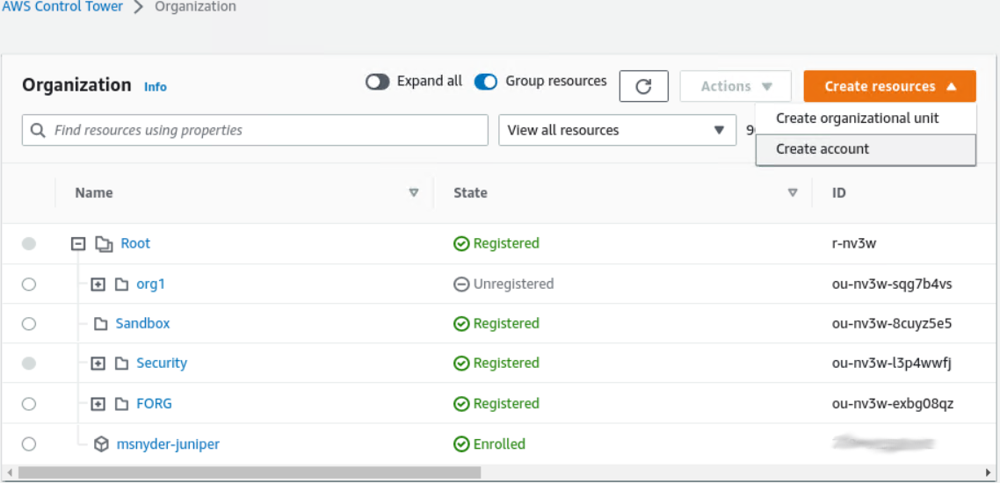</center>
</p>
<p align="center">
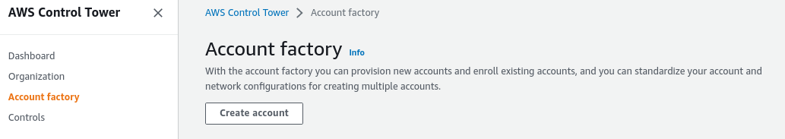</center>
</p>

2. Fill out the account information, ensuring that the new created child OU is selected under the Organizational unit section. Create account.

<br>


<p align="center">
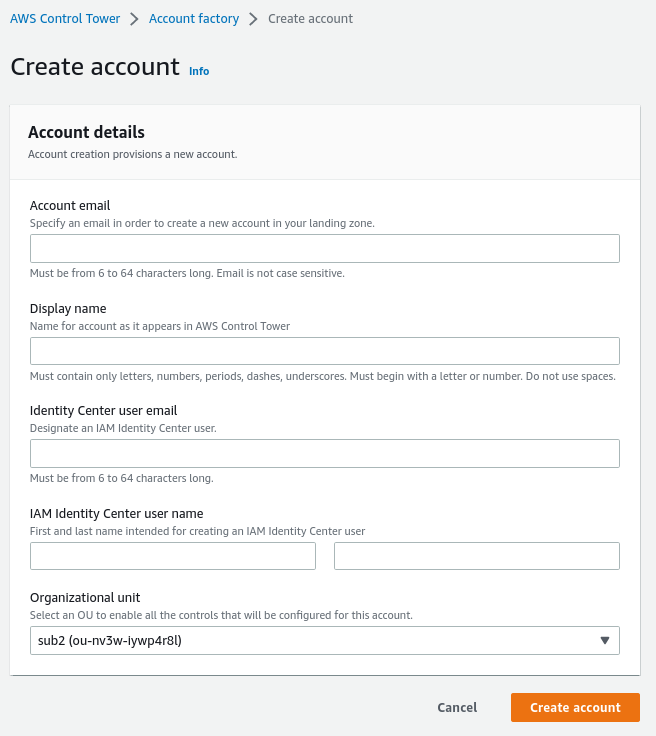</center>
</p>


In this example, the account is now enrolled within Control Tower.

<h4>Method 2 - Using Organizations to create an account </h4>

1. From AWS Organizations, click on Add an AWS account.

   <br>

<p align="center">
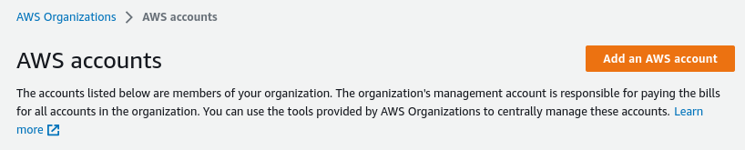</center>
</p>


2. From the add AWS account, select Create an AWS Account and add a valid email address.  Please note, that a valid email address should be used. This account may or may not be deleted without a valid email in the future without AWS support. Once completed click Create AWS account. This new account will be located in the root Organization.

   <br>

<p align="center">
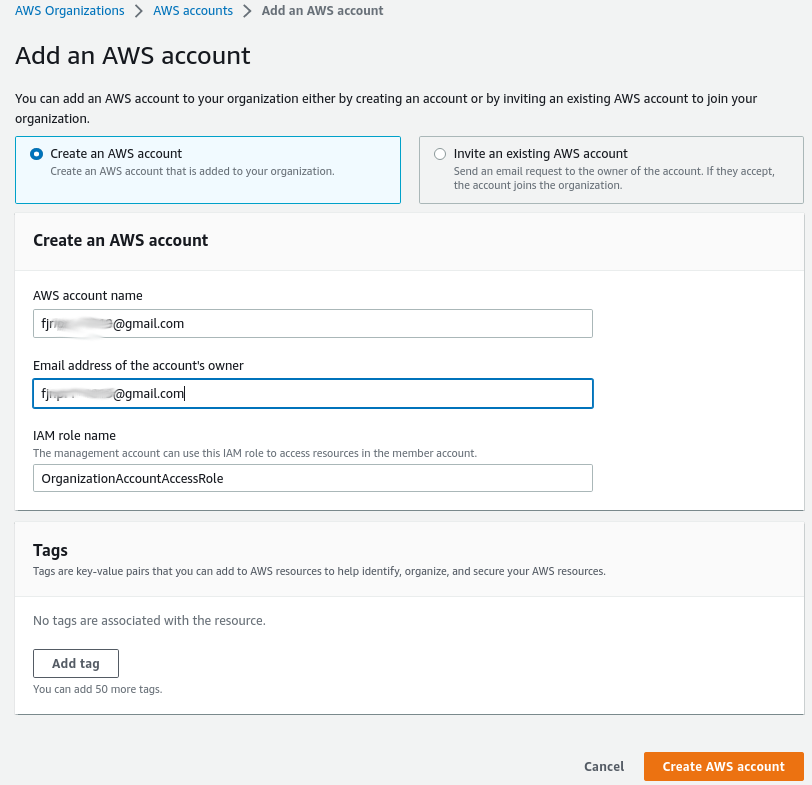</center>
</p>


3. Move the new account into the created Child OU, from the previous step.

   <br>

<p align="center">
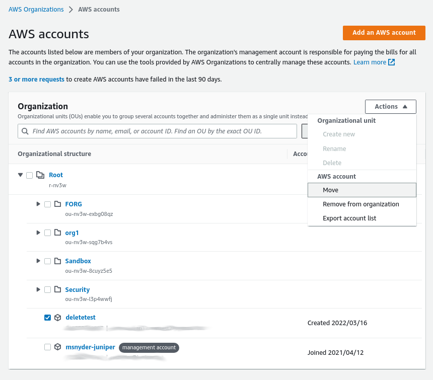</center>
</p>


4. Ensure to select the new child OU previously created for the destination.

   <br>

<p align="center">
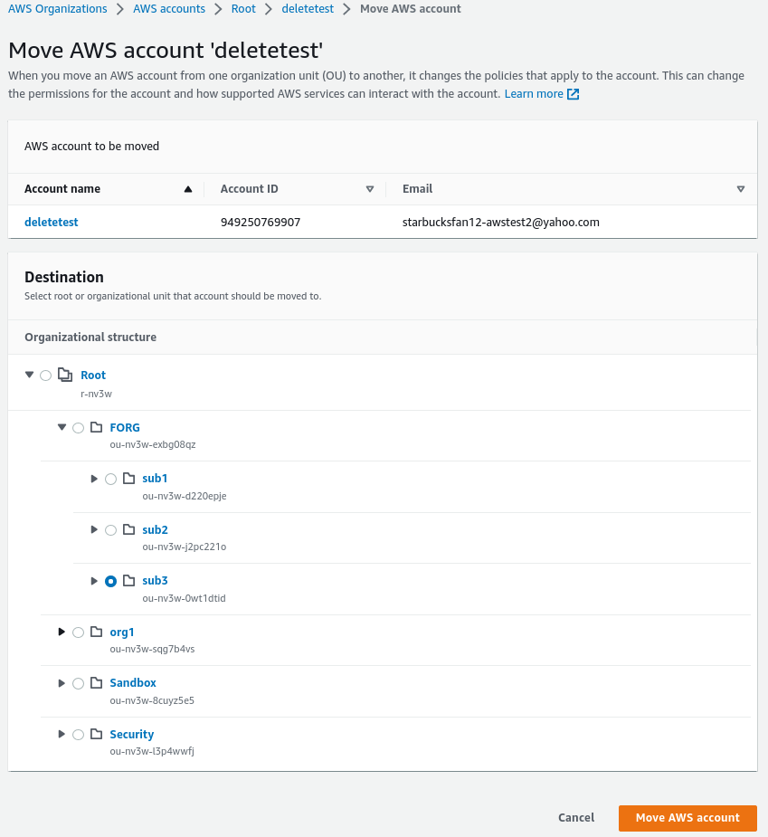</center>
</p>


<h4> The final results </h4>

The final results should look similar to the results underneath for both the OU creation and the account creation. In the example underneath. The Security Infrastructure OU is FORG, and sub1, sub2 and sub3 are child OU's where all child Organization's traffic traverses through the vSRX within the Security Infrastructure Organization hub VPC.

<h4> AWS Organizations - Should look like the following </h4>


   <br>


<p align="center">
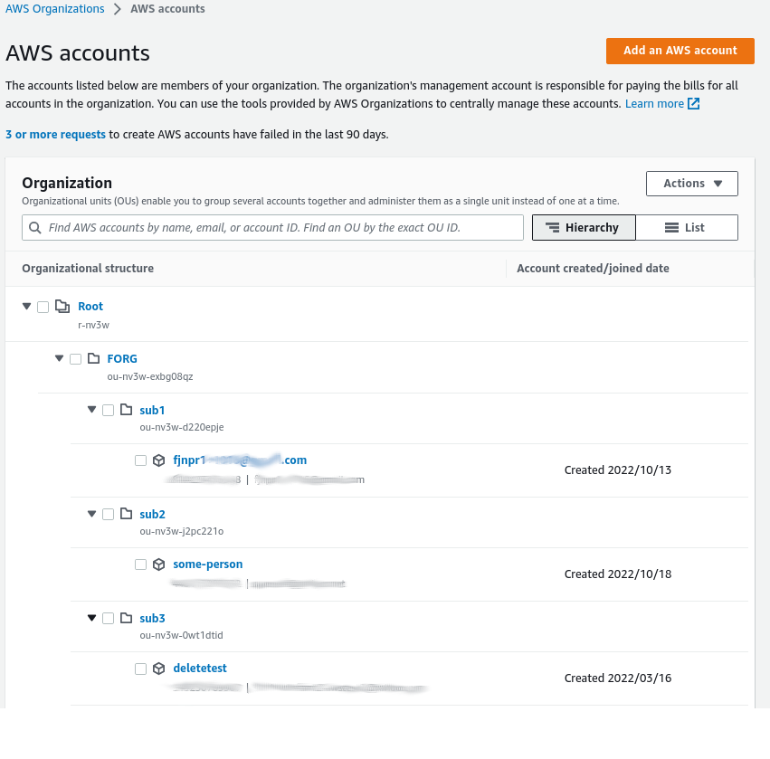</center>
</p>

<h4> Control Tower - Should look like the following </h4>

   <br>

   <br>

<p align="center">
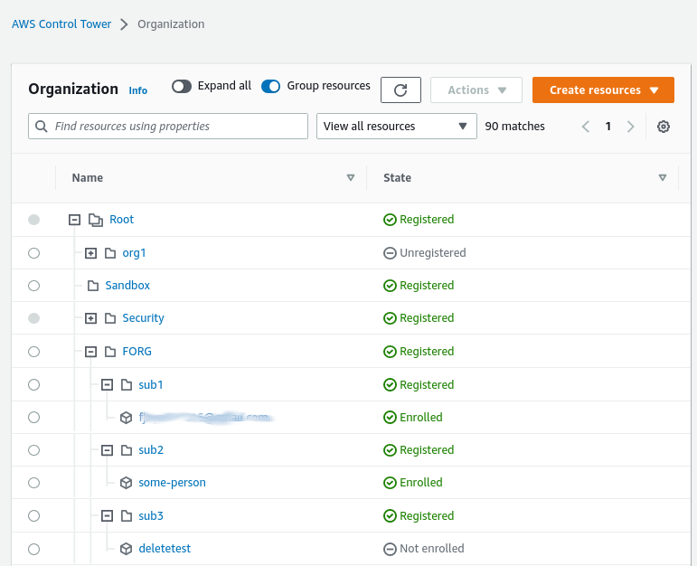</center>
</p>


</ul>

<h4> Troubleshooting </h4>
<ul>
<h4> Deployment and Use </h4>

Ensure that during deployment that the root account is not being used, and work is done from the root Organization.  Ensure that all prerequisites steps are followed.   For any Stackset failures, review the information provided by CloudFormation under the operations section. Further details can be found in the underlying stacks at the Security Infrastructure OU. Almost all errors are due to IAM roles or IAM access issues. Check cloudwatch logs. There are two separate logs, one for organizations and the other for accounts. Expand the logs to show the details.  Most likely, it will be IAM role or rights issue. The logs will be the same name of the lambda function name that were created.
</ul>

<h3>Release information </h3>

<ul>
All code, templates and other files in this repository are released on an “AS IS” BASIS, WITHOUT WARRANTIES, CONDITIONS, OR SUPPORT OBLIGATIONS OF ANY KIND, EXPRESS OR IMPLIED.

</ul>

<h3> Related and Supporting links </h3>
<ul>

[ Juniper Networks SRX Firewall    ](https://www.juniper.net/us/en/solutions/next-gen-firewall.html)   <br>
[Juniper Networks AWS Github](https://github.com/Juniper/vSRX-AWS)   <br>
[vSRX Deployment Guide for Private and Public Cloud Platforms](https://www.juniper.net/documentation/us/en/software/vsrx/vsrx-consolidated-deployment-guide/vsrx-aws/topics/concept/security-vsrx-aws-overview.html)   <br>
YouTube video - WIP
</ul>

<h3> Author </h3>
<ul> Mark Snyder  <br>
Juniper Networks <br>
msnyder@juniper.net  <br>

[https://linkedin.com/in/m-snyder](https://linkedin.com/in/m-snyder)
</ul>


## Disclaimer

The code provided on this GitHub repository is provided "as is" and without any warranty, express or implied. By using this code, you acknowledge and agree to the following terms:

1. No Liability: The author of this code shall not be held liable for any damages, including but not limited to direct, indirect, incidental, special, or consequential damages, arising out of the use or inability to use this code, even if the author has been advised of the possibility of such damages.

2. No Warranty: The author makes no representations or warranties of any kind concerning the code, including but not limited to its accuracy, completeness, reliability, suitability, or fitness for any particular purpose. The code is provided without any warranty whatsoever, whether express, implied, or statutory.

3. Use at Your Own Risk: The use of this code is solely at your own risk. It is your responsibility to ensure that the code meets your specific requirements and is compatible with your software and systems. The author disclaims any responsibility for any adverse effects that may arise from the use of this code.

4. No Support: The author is under no obligation to provide support, assistance, or maintenance for the code. Any assistance provided by the author is at their sole discretion and may be subject to separate terms and conditions.

5. Third-Party Content: This code may incorporate or rely upon third-party libraries, modules, or other components. The author does not guarantee the accuracy, reliability, or suitability of any third-party content used in this code and shall not be responsible for any damages resulting from the use of such content.

By using this code, you agree to release and hold harmless the author from any and all claims, demands, or actions arising out of or in connection with your use of the code. If you do not agree with these terms, you should not use the code.

Please note that this disclaimer does not exempt the author from any liability that cannot be excluded or limited under applicable law.

## Attribution

The code provided in this GitHub repository is released under MIT License. You are free to use, modify, and distribute the code in accordance with the terms of the license.

When using this code or any part of it, you are required to provide proper attribution to the original author by including the following attribution notice:

"Code by [Mark Snyder](https://linkedin.com/in/m-snyder)"

Please ensure that the attribution notice is clearly visible in your project, such as in the source code files, documentation, or project readme. It helps acknowledge the original author's contributions and allows others to locate the original source.

Thank you for respecting the terms of use and providing the necessary attribution.


## Rights

* Sample video Countdown.mp4 is from Pixabay's video  Thank you MCZerrill for its creation
* Vault.png is from Bethesda Software's game Fallout 3.  Thanks to Bethesda for creating such a great game... 


