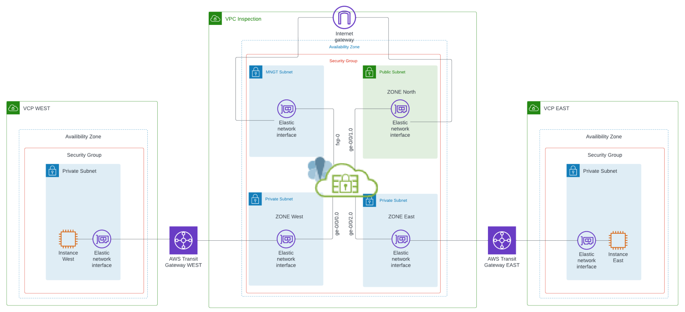
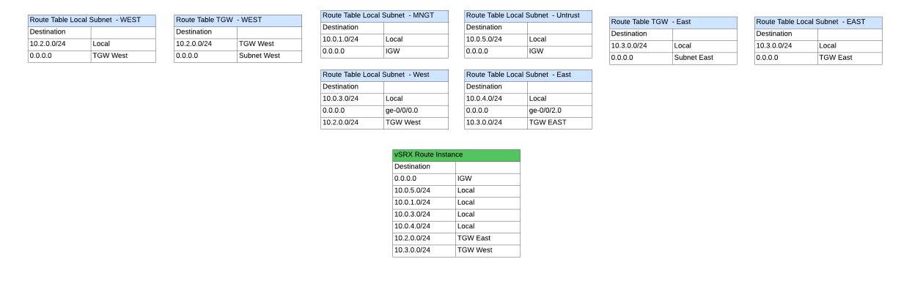
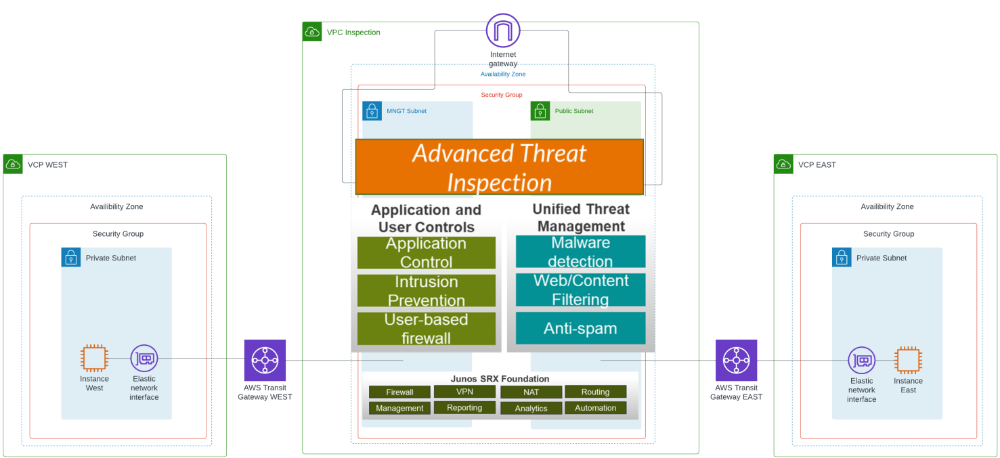

# A Sample deployment using a vSRX as a secure gateway between multiple AWS TGWs. Using the vSRX as an inspection VPC for North South and East West Traffic 

<ul>
In this use case, the vSRX is used to block and inspect traffic and or perform traditional UTM, NG and threat detection:

* For North bound inbound and outbound traffic from devices within other VPC attached via TGWs
* For East and West traffic traversing through the inspection VPC
</ul>
<ul>

The provided AWS CloudFormation template, builds out the following design to be used as a sample.
The build includes the following:
* Three VPCs, Inspection VPC, West and East VPC.
* Three Instances, vSRX for inspection, and two AWS Linux hosts. One host in each VCP
* Each of the hosts has an apache web server deployment script that can be used for testing. It can be ran via sudo ./script1.sh
* Each of the hosts can be accessed by SSH and HTTP through the vSRX with port forwarding. Host West ssh port-2202 http port-8002 and Host East ssh port-2203 http 8003.   
* All host traffic is routed through the inspection VPC and access to the hosts goes through the SRX via AWS IGW public IP, created during launch.
* All hosts and the SRX use the same key pair for access
* The SSH key pair is created via the CFT template,  THe public key, is stored in SSM in the parameter store and can be accessed there. Key content can be copy and pasted locally, or accessed via AWS cli. 
* THe vSRX has been pre-configured via cloud_init, to include interfaces, source and destination NAT, route instances and tables, and basic zone and security policies. 
*    ***vSRX POLICIES are set to ANY ANY **** so please adjust accordingly...   
    

</ul>

<h3> Architectural design  </h3>

<h3> Route Tables  </h3>

<h3> Architectural high level VPC Inspection possibilities </h3>

