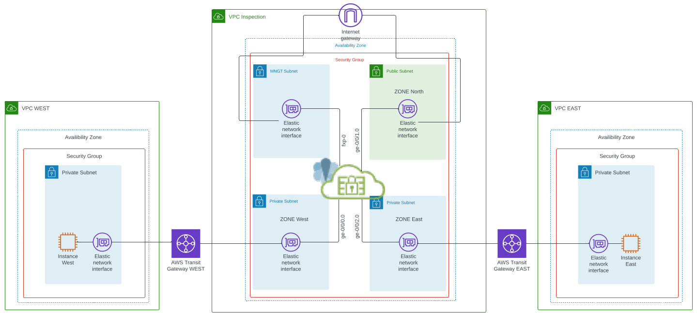
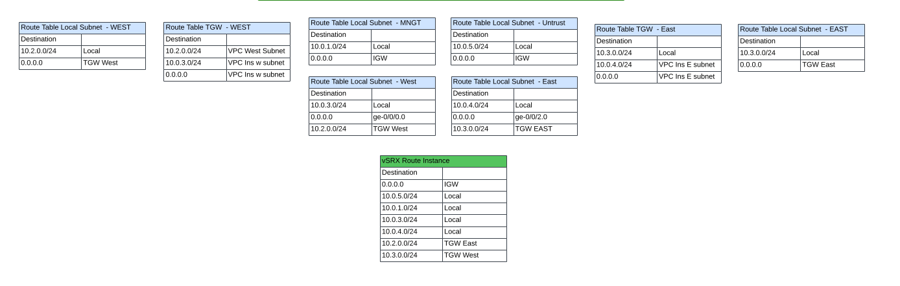
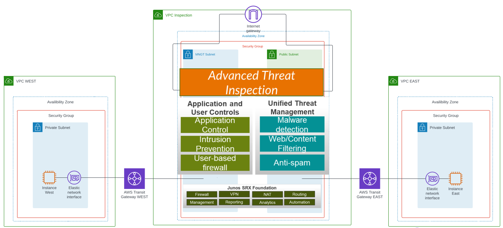

# A Sample deployment using a vSRX as a secure gateway between multiple AWS TGWs. Using the vSRX as an inspection VPC for North South and East West Traffic 

<ul>
In this example, the vSRX is used to block and inspect traffic and or perform traditional UTM, NG and threat detection:

* For North bound inbound and outbound traffic from devices within other VPC attached via TGWs
* For East and West traffic traversing through the inspection VPC
</ul>
<ul>

The provided AWS CloudFormation template, builds out the following design to be used as a sample.
The build includes the following:
* Three VPCs, Inspection VPC, West and East VPC.
* Three Instances, vSRX for inspection, and two AWS Linux hosts. One host in each VCP
* Each of the hosts has an apache web server deployment script that can be used for testing. It can be ran via sudo ./script1.sh
* Each of the hosts can be accessed by SSH and HTTP through the vSRX with port forwarding. Host West ssh port-2202 http port-8002 and Host East ssh port-2203 http 8003.   
* All host traffic is routed through the inspection VPC and access to the hosts goes through the SRX via AWS IGW public IP, created during launch.
* All hosts and the SRX use the same key pair for access
* The SSH key pair is created via the CFT template,  THe public key, is stored in SSM in the parameter store and can be accessed there. Key content can be copy and pasted locally, or accessed via AWS cli. 
* THe vSRX has been pre-configured via cloud_init, to include interfaces, source and destination NAT, route instances and tables, and basic zone and security policies. 
*    ***vSRX POLICIES are set to ANY ANY **** so please adjust accordingly...   
    

</ul>

<h3> Architectural design  </h3>

<h3> Route Tables  </h3>

<h3> Architectural high level VPC Inspection possibilities </h3>

## Disclaimer

The code provided on this GitHub repository is provided "as is" and without any warranty, express or implied. By using this code, you acknowledge and agree to the following terms:

1. No Liability: The author of this code shall not be held liable for any damages, including but not limited to direct, indirect, incidental, special, or consequential damages, arising out of the use or inability to use this code, even if the author has been advised of the possibility of such damages.

2. No Warranty: The author makes no representations or warranties of any kind concerning the code, including but not limited to its accuracy, completeness, reliability, suitability, or fitness for any particular purpose. The code is provided without any warranty whatsoever, whether express, implied, or statutory.

3. Use at Your Own Risk: The use of this code is solely at your own risk. It is your responsibility to ensure that the code meets your specific requirements and is compatible with your software and systems. The author disclaims any responsibility for any adverse effects that may arise from the use of this code.

4. No Support: The author is under no obligation to provide support, assistance, or maintenance for the code. Any assistance provided by the author is at their sole discretion and may be subject to separate terms and conditions.

5. Third-Party Content: This code may incorporate or rely upon third-party libraries, modules, or other components. The author does not guarantee the accuracy, reliability, or suitability of any third-party content used in this code and shall not be responsible for any damages resulting from the use of such content.

By using this code, you agree to release and hold harmless the author from any and all claims, demands, or actions arising out of or in connection with your use of the code. If you do not agree with these terms, you should not use the code.

Please note that this disclaimer does not exempt the author from any liability that cannot be excluded or limited under applicable law.

## Attribution

The code provided in this GitHub repository is released under MIT License. You are free to use, modify, and distribute the code in accordance with the terms of the license.

When using this code or any part of it, you are required to provide proper attribution to the original author by including the following attribution notice:

"Code by [Mark Snyder](https://linkedin.com/in/m-snyder)"

Please ensure that the attribution notice is clearly visible in your project, such as in the source code files, documentation, or project readme. It helps acknowledge the original author's contributions and allows others to locate the original source.

Thank you for respecting the terms of use and providing the necessary attribution.

## Rights

* Sample video Countdown.mp4 is from Pixabay's video  Thank you MCZerrill for its creation
* Vault.png is from Bethesda Software's game Fallout 3.  Thanks to Bethesda for creating such a great game... 

